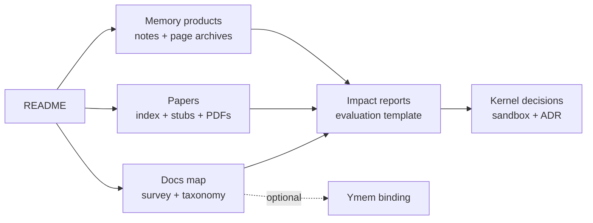

# awesome-agent-memory

**Long-term memory for LLM agents — a decision-driven reading list, 989-paper index, and living survey covering memory architectures, retrieval, consolidation, and forgetting.**

[中文](README_cn.md) · **English**

---

## Table of contents

1. [At a glance](#at-a-glance)
2. [Repository map](#repository-map)
3. [Read first](#read-first)
4. [Repository layout](#repository-layout)
5. [License / archival policy](#license--archival-policy)
6. [Origin / maintenance](#origin--maintenance)

## At a glance

| Area | Count | Entry point | What it is for |
|---|---:|---|---|
| Paper index | 989 papers | [`papers/index.md`](papers/index.md) | Searchable entry point for agent-memory papers. |
| Paper stubs | 988 stubs | [`papers/stubs/`](papers/stubs/) | Lightweight coverage records for papers not yet fully read. |
| Local PDFs | 534 files | [`papers/pdfs/`](papers/pdfs/) | Archived PDFs for stable reading and audit. |
| Full / seed notes | 7 full + 2 seed | [`papers/`](papers/) | Human-read paper notes and notes in progress. |
| Memory product notes | 10 notes | [`products/`](products/) | Notes on existing memory infrastructure and agent-memory products. |
| Page archives | 9 snapshots | [`products/archives/`](products/archives/) | Markdown snapshots for memory-product page auditability. |
| Survey docs | 1 living survey + 6 meta-survey records | [`docs/agent-memory-survey.md`](docs/agent-memory-survey.md) · [`docs/meta-surveys.md`](docs/meta-surveys.md) | Maintainer synthesis and survey tracking. |

## Repository map

## Read first

If this is your first visit, use these entry points in order:

1. [`docs/README.md`](docs/README.md) — map of the documentation set.
2. [`docs/agent-memory-survey.md`](docs/agent-memory-survey.md) — the living survey and current maintainer synthesis.
3. [`docs/taxonomy.md`](docs/taxonomy.md) — the shared vocabulary for forms, functions, dynamics, persistence, and curation.
4. [`papers/index.md`](papers/index.md) — the 989-paper index, organized for discovery and follow-up reading.
5. [`docs/products-landscape.md`](docs/products-landscape.md) — memory product notes grouped by domain and audience.

## Repository layout

### Concept files (top level)

All concept docs now live under [`docs/`](docs/). Start with
[`docs/README.md`](docs/README.md) if you want the shortest map.

| File | Purpose |
|---|---|
| [`docs/README.md`](docs/README.md) | Documentation map: what to read first and where each concept lives. |
| [`docs/agent-memory-survey.md`](docs/agent-memory-survey.md) | A living literature review by the maintainer. |
| [`docs/meta-surveys.md`](docs/meta-surveys.md) | Index of **external** meta-surveys (2025-12 ~ 2026-05). |
| [`docs/taxonomy.md`](docs/taxonomy.md) | Generic agent-memory taxonomy: cross-walk of 3 external frameworks. |
| [`docs/research-radar.md`](docs/research-radar.md) | Generic Radar schema for ResearchItem and ImpactReport notes. |
| [`docs/information-sources.md`](docs/information-sources.md) | 10-category source catalog with a dedicated zh-CN section. |
| [`docs/related-work.md`](docs/related-work.md) | Discovery-input attribution and scrape provenance. |
| [`docs/products-landscape.md`](docs/products-landscape.md) | Memory products by **domain × audience**. |
| [`docs/signals.md`](docs/signals.md) | Reverse-chrono 2026 H1 release / memory product / blog log. |

### Per-item notes

| Path | Contents |
|---|---|
| [`papers/`](papers/) | 7 full paper notes, 2 seed notes, and master [`index.md`](papers/index.md). |
| [`papers/stubs/`](papers/stubs/) | 988 auto-generated stubs for papers not yet fully read. |
| [`papers/pdfs/`](papers/pdfs/) | 534 archived PDFs (~1.8 GB). See archival policy. |
| [`papers/_scrape/`](papers/_scrape/) | Reproducibility artifacts: scrape script + dedup JSON. |
| [`products/`](products/) | 10 memory product notes (Mem0, Letta, Zep, Graphiti, …). |
| [`products/archives/`](products/archives/) | Markdown snapshots of canonical memory product pages. |
| [`docs/ymem-binding/`](docs/ymem-binding/) | Project-specific bindings from the maintainer's [Ymem](https://github.com/Snseam/Ymem) kernel; safe to ignore if you don't use Ymem. |

## License / archival policy

Notes and survey content are released under the [Apache License 2.0](LICENSE).
Quoted excerpts from external papers and articles remain the property of
their respective authors and are used under fair use / fair dealing for
commentary and research purposes.

**Locally archived PDFs** (`papers/pdfs/`) come from sources that explicitly
permit redistribution — arXiv perpetual non-exclusive license, CC-BY at ACL
Anthology, open OpenReview submissions, etc. If you find a PDF here whose
source restricts redistribution, please open an issue; we will remove it.
The canonical URL in the corresponding note's `urls` field remains the
authoritative source.

**Memory product page snapshots** (`products/archives/`) are research backups,
captured so that this repo's reasoning stays auditable when source pages
change or disappear. They are **not** re-published material; commercial
citation should always use the original URL in the snapshot's `source_url`
header.

## Origin / maintenance

This repo was started by the
[**Ymem**](https://github.com/Snseam/Ymem) project, but the top-level
documentation is intended to stay useful for any agent-memory kernel. Ymem
specific bindings — module names, maintainer stance, and internal benchmark
choices — live in [`docs/ymem-binding/`](docs/ymem-binding/) so the public
entry points remain project-neutral.

The paper index also uses a small set of public awesome-list repositories as
discovery inputs. Source attribution and scrape artifacts live in
[`docs/related-work.md`](docs/related-work.md) and
[`papers/_scrape/`](papers/_scrape/). These inputs are used for discovery only;
notes, survey synthesis, and maintainer judgments are maintained here.

---

> *Notes are authored by the maintainer. Some stubs and first drafts were
> accelerated with LLM tooling; every full note is grounded in the actual
> PDF or memory product page that was read, not in unverified secondary summaries.*

**[Survey](docs/agent-memory-survey.md)** ·
**[Docs map](docs/README.md)** ·
**[Papers index](papers/index.md)** ·
**[Memory products landscape](docs/products-landscape.md)** ·
**[Signals](docs/signals.md)** ·
**[中文版](README_cn.md)**

