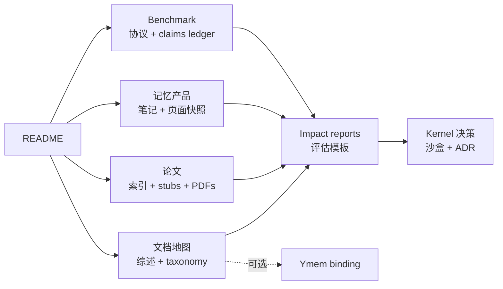

# awesome-agent-memory

**面向 LLM agent 长程记忆的研究入口 —— 决策驱动的阅读清单、989 篇论文索引、活综述,涵盖记忆架构、检索、整合与遗忘。**

**中文** · [English](README.md)

---

## 目录

1. [一眼总览](#一眼总览)
2. [仓库地图](#仓库地图)
3. [先读这里](#先读这里)
4. [仓库结构](#仓库结构)
5. [License 与存档策略](#license-与存档策略)
6. [发起方与维护](#发起方与维护)
7. [贡献](#贡献)

## 一眼总览

| 板块 | 数量 | 入口 | 用途 |
|---|---:|---|---|
| 论文索引 | 989 篇论文 | [`papers/index.md`](papers/index.md) | 检索 agent memory 论文的主入口。 |
| 论文 stub | 988 个 stub | [`papers/stubs/`](papers/stubs/) | 尚未 full 阅读论文的轻量覆盖记录。 |
| 本地 PDF | 534 个文件 | [`papers/pdfs/`](papers/pdfs/) | 稳定阅读和审计用的 PDF 存档。 |
| full / seed 笔记 | 7 个 full + 2 个 seed | [`papers/`](papers/) | 已人工阅读或正在推进的论文笔记。 |
| 记忆产品笔记 | 34 个笔记 | [`products/`](products/) | 市面上已有的记忆基础设施和 agent-memory 产品记录。 |
| 页面快照 | 33 个快照 | [`products/archives/`](products/archives/) | 用于审计的记忆产品页面 markdown 快照。 |
| Benchmark 目录 | 12 个 seed 条目 | [`benchmarks/index.md`](benchmarks/index.md) | 与论文、产品并列的评测协议和使用 claims ledger。 |
| 综述文档 | 1 份活综述 + 6 条 meta-survey 记录 | [`docs/agent-memory-survey.md`](docs/agent-memory-survey.md) · [`docs/meta-surveys.md`](docs/meta-surveys.md) | 维护者综合判断与综述追踪。 |

## 仓库地图

## 先读这里

第一次打开本仓,建议按这个顺序读:

1. [`docs/README.md`](docs/README.md) —— 文档地图,快速判断每份文档负责什么。
2. [`docs/agent-memory-survey.md`](docs/agent-memory-survey.md) —— 活综述与当前维护者综合判断。
3. [`docs/taxonomy.md`](docs/taxonomy.md) —— forms / functions / dynamics / persistence / curation 的共享词表。
4. [`papers/index.md`](papers/index.md) —— 989 篇论文索引,用于发现线索和后续阅读。
5. [`docs/benchmarks-landscape.md`](docs/benchmarks-landscape.md) —— benchmark 使用、证据等级和跨来源统计。
6. [`docs/products-landscape.md`](docs/products-landscape.md) —— 按领域和服务对象整理的记忆产品全景。
7. [`docs/product-memory-architectures.md`](docs/product-memory-architectures.md) —— 跨产品 memory 架构模式与图谱。

## 仓库结构

### 顶层概念文档

所有概念文档现已收纳到 [`docs/`](docs/) 子目录。如果只想先看地图,从
[`docs/README.md`](docs/README.md) 开始。

| 文件 | 用途 |
|---|---|
| [`docs/README.md`](docs/README.md) | 文档地图:先读什么、每份概念文档放在哪里。 |
| [`docs/agent-memory-survey.md`](docs/agent-memory-survey.md) | 维护者的活综述。 |
| [`docs/meta-surveys.md`](docs/meta-surveys.md) | **外部** meta-survey 索引(2025-12 ~ 2026-05)。 |
| [`docs/taxonomy.md`](docs/taxonomy.md) | 通用 agent memory taxonomy:三套外部分类轴对照。 |
| [`docs/research-radar.md`](docs/research-radar.md) | ResearchItem 与 ImpactReport 笔记的通用 Radar schema。 |
| [`docs/information-sources.md`](docs/information-sources.md) | 10 类信息源 catalog,含 zh-CN 独立节。 |
| [`docs/related-work.md`](docs/related-work.md) | 发现线索归因与抓取来源记录。 |
| [`docs/products-landscape.md`](docs/products-landscape.md) | 记忆产品按**领域 × 服务对象**全景。 |
| [`docs/product-discovery-log.md`](docs/product-discovery-log.md) | 多子 agent 产品搜索日志,记录 Tier A / Tier B / 拒绝理由。 |
| [`docs/product-memory-architectures.md`](docs/product-memory-architectures.md) | 跨产品 memory 架构模式与对比图谱。 |
| [`docs/product-architecture-diagrams.md`](docs/product-architecture-diagrams.md) | 基于公开资料的逐产品 Mermaid 架构图。 |
| [`docs/benchmarks-landscape.md`](docs/benchmarks-landscape.md) | 按能力、使用方式和独立性拆分的 benchmark 全景。 |
| [`docs/signals.md`](docs/signals.md) | 2026 H1 反时序日志(release / memory product / blog)。 |

### 逐条笔记

| 路径 | 内容 |
|---|---|
| [`papers/`](papers/) | 7 个 full 论文笔记、2 个 seed 笔记 + 主索引 [`index.md`](papers/index.md)。 |
| [`papers/stubs/`](papers/stubs/) | 988 个尚未 full 阅读论文的自动生成 stub。 |
| [`papers/pdfs/`](papers/pdfs/) | 534 个本地 PDF(~1.8 GB)。详见存档策略。 |
| [`papers/_scrape/`](papers/_scrape/) | 可复现产物:抓取脚本 + dedup JSON。 |
| [`products/`](products/) | 34 个记忆产品笔记。 |
| [`products/archives/`](products/archives/) | 33 个记忆产品页面的 markdown 快照。 |
| [`benchmarks/`](benchmarks/) | 12 个 benchmark seed 条目和一等评测协议笔记。 |
| [`benchmarks/claims/`](benchmarks/claims/) | benchmark 使用、厂商自报、批评和复现的事件 ledger。 |
| [`benchmarks/archives/`](benchmarks/archives/) | benchmark 页面、repo、dataset card 的可选审计快照。 |
| [`docs/ymem-binding/`](docs/ymem-binding/) | 维护者所在的 [Ymem](https://github.com/Snseam/Ymem) 项目特定绑定;如果你不维护 Ymem,可以跳过。 |

## License 与存档策略

笔记与综述内容以 [Apache 2.0](LICENSE) 协议发布。
**引用自外部论文与文章的摘录**仍归原作者所有,本仓在 fair use / fair dealing
框架下出于研究评议目的使用。

**本地存档 PDF**(`papers/pdfs/`)均来自允许 redistribute 的来源 ——
arXiv perpetual non-exclusive license、ACL Anthology 的 CC-BY、OpenReview
开放投稿等。若发现本仓某 PDF 的源协议禁止 redistribute,请开 issue,
我们会撤下;对应笔记 `urls` 字段中的 canonical URL 仍是权威来源。

**记忆产品页面快照**(`products/archives/`)是研究备份,用以让本仓的推理在源
页面变更或消失后仍可审计。它们**不是**重新发布材料;商用引用请以快照 header
中的 `source_url` 为准。

## 发起方与维护

本仓由 [**Ymem**](https://github.com/Snseam/Ymem)(一个 agent memory
kernel)项目发起,但顶层文档应当对任何 agent-memory kernel 都有用。
**Ymem 特定绑定** —— 模块名、维护者立场、内部 benchmark 选择 —— 收纳到
[`docs/ymem-binding/`](docs/ymem-binding/) 子目录,以确保公开入口保持项目中性。

论文索引整理时也参考了若干公开 awesome-list 仓库作为发现线索;具体来源、
抓取记录与归因见 [`docs/related-work.md`](docs/related-work.md) 和
[`papers/_scrape/`](papers/_scrape/)。这些来源仅作为发现入口;条目说明、
综述判断和维护口径由本仓独立整理。

## 贡献

参见 [`CONTRIBUTING.md`](CONTRIBUTING.md) 与 [`CODE_OF_CONDUCT.md`](CODE_OF_CONDUCT.md)。简言之:

- **新论文** → 先在 `papers/` 加 stub(或升级已有 stub 到 full),然后看是否
  值得写 ImpactReport。
- **新记忆产品** → 在 `products/` 加笔记并存档页面到 `products/archives/`,再
  决定是否需要进入 [`docs/products-landscape.md`](docs/products-landscape.md)。
- **新 benchmark** → 在 `benchmarks/` 加协议笔记,并在
  [`benchmarks/claims/claims.yaml`](benchmarks/claims/claims.yaml) 记录来源和使用事件。
- **新信息源** → 加进 [`docs/information-sources.md`](docs/information-sources.md)
  对应的类目。
- **新发现来源** → 加进 [`docs/related-work.md`](docs/related-work.md) 并记录来源范围。

---

**[活综述](docs/agent-memory-survey.md)** ·
**[文档地图](docs/README.md)** ·
**[Papers 索引](papers/index.md)** ·
**[Benchmark](benchmarks/index.md)** ·
**[记忆产品全景](docs/products-landscape.md)** ·
**[产品架构图谱](docs/product-memory-architectures.md)** ·
**[信号日志](docs/signals.md)** ·
**[English](README.md)**

> *本仓内容由仓库维护者人工撰写,部分 stub 与初稿借助 LLM 工具加速生成;每条
> full 笔记都基于实际的 PDF / 记忆产品页面 grounded,不引用未经验证的二手摘要。*
